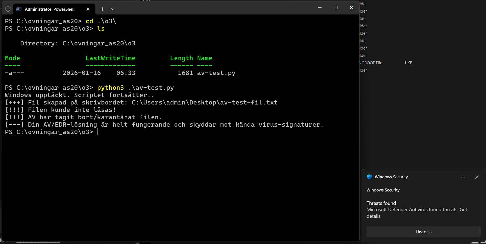
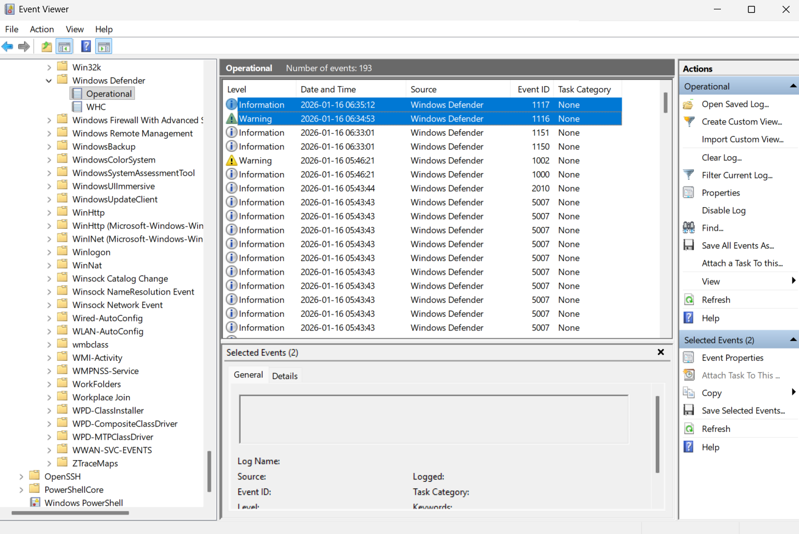

# Övning 2 – AV/EDR Malware Test

Testar hur ett antivirus/EDR i Windows reagerar på en känd malware-signatur genom att ett Python-script skapar en EICAR-testfil och verifierar detektion via Windows Defender och Event Viewer.

  

  

